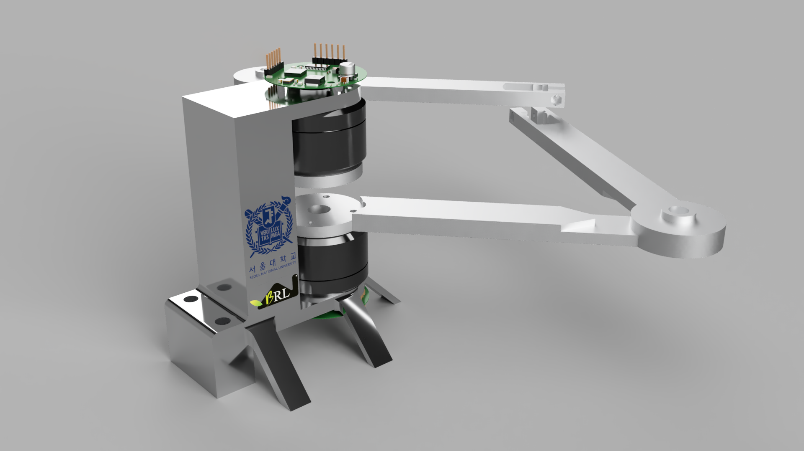
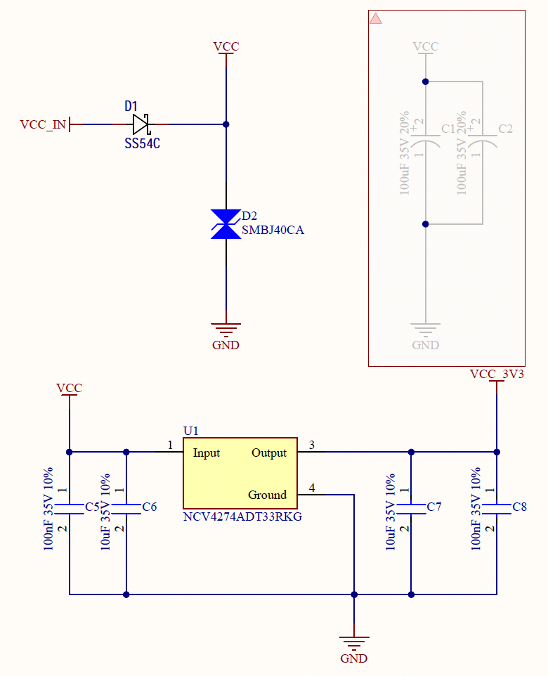
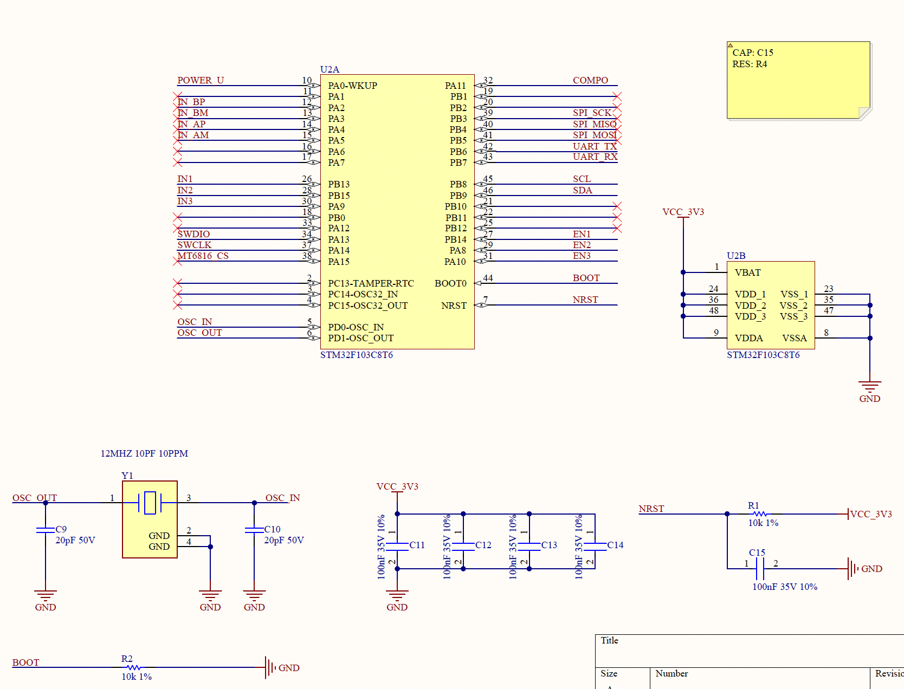
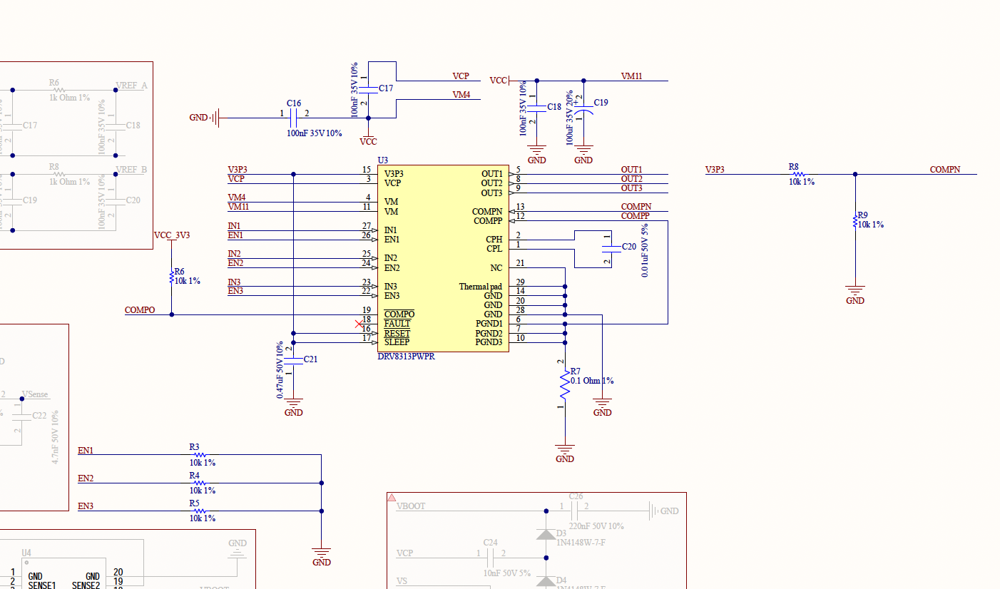
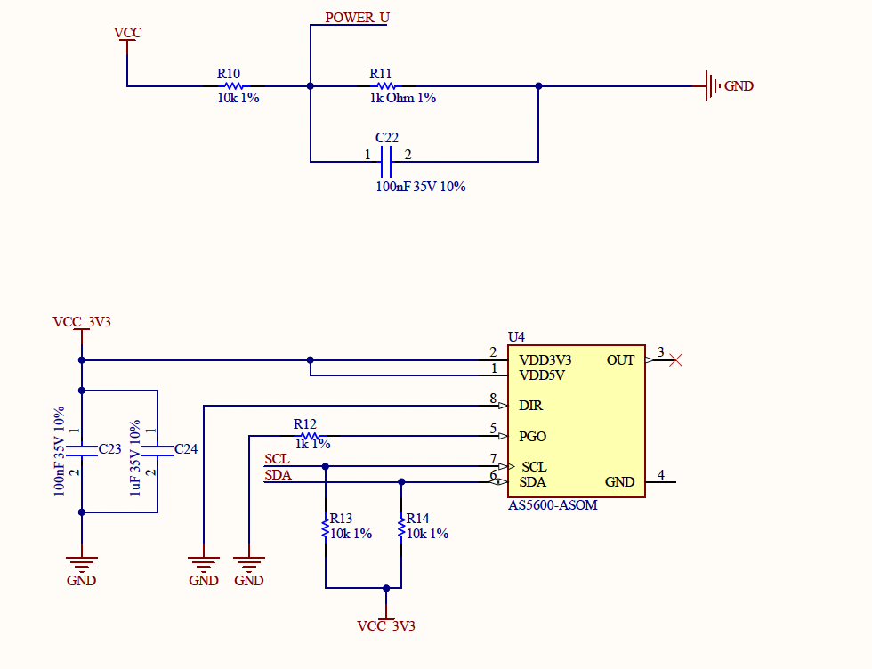

# Introduction

  This is my final project in the master course named "Actuation and Sensing Mechanisms for Robots". The BLDC (Brushless DC Electric Motor) is a famous motor that is used in several research fields. In the seminars and presentations, many different types of robots are introduced including the MIT Cheetah, SEA Module (Series Elastic Actuator), RHex, Sprawl, and so on. 

  In this course, we need to do the final project which is determined by ourselves.  The main reason for us to choose the BLDC is that the robot is usually driven by a motor and I want to get in touch with the driving, sensing, and controlling of this motor. In this project, I designed and assembled the PCB for motor driving and sensing, and programmed the control algorithm with the FOC (Field Orientated Control). Thus, after this project, I am familiar with the motor driver, magnetic sensor, i2c protocol, and FOC algorithm.

  In this Blog, I will introduce the BLDC Driver, Magnetic Sensor,  FOC algorithm, and the inverse kinematics of the 5-bar linkage with the final project.

# BLDC Driver (PCB)

  As you all know, the main differece between the BLDC motor and DC motor is the bursh which could change the current direction and cause the magnetic force could be change in the right hand rule. Because the BLDC motor is brushless, it is needed the signal generated by the driver to change the current direction. I think it is the main reason for the driver used in BLDC. The driver could provide the different frequencies and phase deviations with MCUs (Micro-controller Unit). The power of the MCU always use 5V and 3.3V, and this is not enough to supply the rotate power overcome the friction. Thus it is always using the amplify circuit or driver chip to get the higher voltage signal. In this module, I seperate it in 5 parts: Power, MCUs, Driver, Sensor, and Port. I will introduce detaily about the Power, Driver and briefly about the others.

## Power Module

   The `VCC_IN` is the power source provided by the adjustable power supply. In the whole design, the maximum power need to under 35V and 3A. Thus I choose the capacitors which can be used under 35V. At the upper left conner of the image, the diode SS54C and Zener tube SMBJ40CA are used the VCC in the relatively stabe state. And the dioed also avoid the mistake of reverse the power supply. The Unit 1 is the linear regulator which is mainly used to get the MCUs power supply. This component is get `VCC` as input and `VCC_3V3` as output, it can linearly decrease the voltage and the other capacitors are mainly used to eliminate the noise.

  Thus, the power module is mainly used to generate the power to supply the MCUs. There are many other components to design the power supply module, like switch regulator, and provide the `VCC_5V` which is always used to power the sensor components.

## MCU Module

  As you all know, the Micro-Controller Unit plays an important role in the whole design. I use the common MCU which pin outs are enough to generate PWM signals and other connectivity protocol. As the figure shown, I use the STM32F103C8T6 type to generate 3 PWM signals and 1 I2C protocol. The 12Mhz crystal oscillator is the external clock to give into the MCU, which could generate high frequency signals based on it.

  After a mount of experiments, I know the `BOOT` function is always linked to ground. And it means I need to stop power and repower the whole board can reboot the Micro-Controller Unit after upload my new code. It is so unconvinient that I always need to reboot the adjustable power supply. For cover that, it can use the button linking to the `BOOT` label and press down it when you want to reboot.

## DRIVER & SENSOR

  First, I want to explain why the driver is needed. The maximum output voltage and current of MCU are limited under 3.3V and 0.1mA. Thus the power is limited no more enough to drive the Motor, which is always needed 24V and 3A. I make this circuit under the document of its data sheet. The main function of this unit is amplifying the input signal based on the `VM11` voltage. It like the basic amplifier circuit, in which the signal can be amplified to the desired input power supply.

  In this unit, the `ENx` label is control if the output signal can be generated. And the `R7`  is the sampling resistence, which can get the current feedback to calculate the torque in the motor. Others not mentioned are designed with the recommended models and types.

  The magnetic sensor is always used in the motor control, especially in BLDC. The sensor can be embedded in the Motor to detect hall effect, and it also can be attached in the back of the driver board and detect. In my condition, the sensor has not embedded in motor, so I need to attach a magnet in the back of the motor and using the sensor to detect the current position. This sensor use I2C protocol, and this protocol can be simply used two lines  `SCL` and `SDA` with HAL library.

## FOC Algorithm

## Scalable Vector Graphics

  I code the `c++` project to get the scalable vector graphics file and convert it into a mount of points. These points could generally persent the image.

